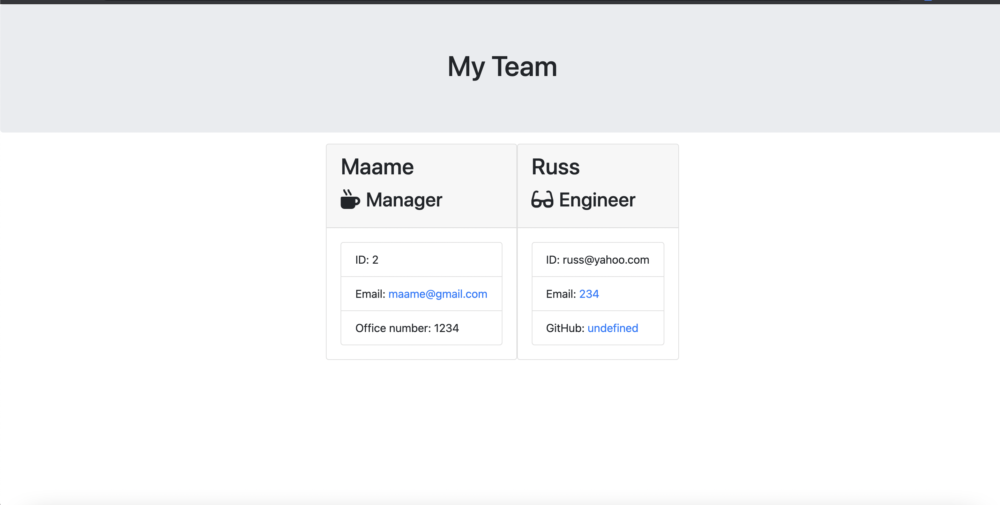
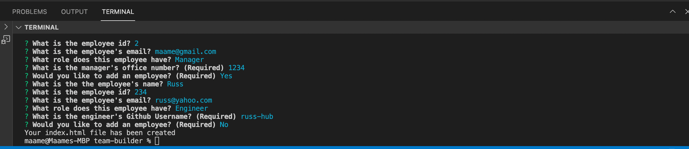

# team-builder

## Description
🔍 A commamnd line application that displays my team's basic info so that I have quick access to their emails and GitHub profiles.

# User Story
AS A manager
I WANT to generate a webpage that displays my team's basic info
SO THAT I have quick access to their emails and GitHub

GIVEN a command-line application that accepts user input
WHEN I am prompted for my team members and their information
THEN an HTML file is generated that displays a nicely formatted team roster based on user input
WHEN I click on an email address in the HTML
THEN my default email program opens and populates the TO field of the email with the address
WHEN I click on the GitHub username
THEN that GitHub profile opens in a new tab
WHEN I start the application
THEN I am prompted to enter the team manager’s name, employee ID, email address, and office number
WHEN I enter the team manager’s name, employee ID, email address, and office number
THEN I am presented with a menu with the option to add an engineer or an intern or to finish building my team
WHEN I select the engineer option
THEN I am prompted to enter the engineer’s name, ID, email, and GitHub username, and I am taken back to the menu
WHEN I select the intern option
THEN I am prompted to enter the intern’s name, ID, email, and school, and I am taken back to the menu
WHEN I decide to finish building my team
THEN I exit the application, and the HTML is generated 

## Built with 
* JAVASCRIPT
* NODE.JS
* INQUIRER.JS
* NPM

# Link to README video 
🎥 Full video tutorial can be found [here]  (https://drive.google.com/file/d/1uGdro-3skdQwZSzoB6AG9IfAb3MT1xIS/view)

# Sample HTML file
A sample HTML file can be found in the fileoutput folder

## Contribution
Made with ❤️ by Maame (with assistance from class repository)

